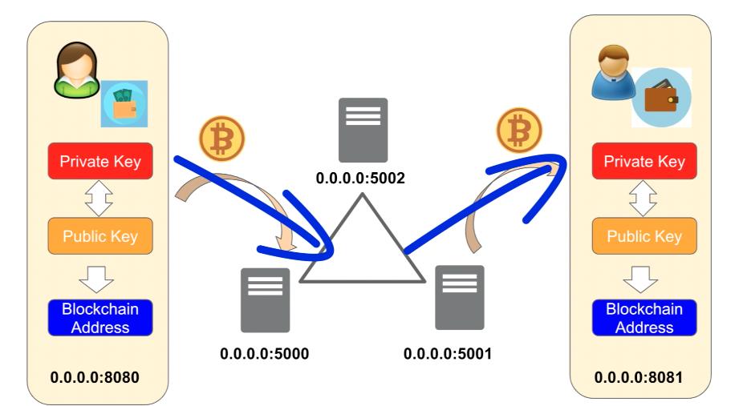

# Go-blockchain
 
ブロックチェーンを用いた仮想通貨の送金システムデモアプリ
 
# DEMO
 

  
# Requirement
 
"hoge"を動かすのに必要なライブラリなどを列挙する
 
* huga 3.5.2
* hogehuga 1.0.2
 
# Installation
 
Requirementで列挙したライブラリなどのインストール方法を説明する
 
```bash
pip install huga_package
```
 
# Usage
 
DEMOの実行方法など、"hoge"の基本的な使い方を説明する
 
```bash
git clone https://github.com/hoge/~
cd examples
python demo.py
```

# Function

* 実装した機能 1
* 実装した機能 2
* 実装した機能 3
# Note
 
注意点などがあれば書く
 
# Author
 
作成情報を列挙する
 
* 作成者
* 所属
* E-mail
 
# License
ライセンスを明示する
 
"hoge" is under [MIT license](https://en.wikipedia.org/wiki/MIT_License).
 
社内向けなら社外秘であることを明示してる
 
"hoge" is Confidential.